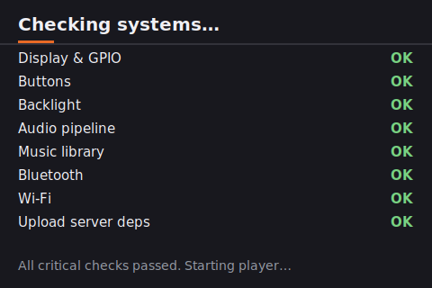

# 📻 Mishmann Player
> A premium, tactile digital minimalist music deck designed for single-board computers (specifically the **Radxa Zero**), utilizing an ILI9488 $480 \times 320$ IPS SPI display and a highly physical, five-button interface.

## 📖 Project Overview

The **Mishmann Player** bridges the gap between the physical warmth of classic vintage tape decks (such as the legendary 1979 Sony Walkman TPS-L2) and the hyper-optimized efficiency of modern digital systems.

Designed to operate entirely headless on embedded hardware, the player discards bloated touch-screen paradigms in favor of a strictly linear, **five-button physical interface**. It features dynamic hardware color extraction, zero-ghosting see-through HUDs, and an innovative split-screen library interface with a smart album collage engine.

## ✨ Key Features

* **🎨 Dynamic HSV Palette Engine:** No static skins. The player extracts dominant colors from the metadata's album art in real-time, mathematically scaling Hue, Saturation, and Value to output sophisticated dark backgrounds and high-contrast complementary neon accents.

* **📼 Mechanical Cassette Spools:** Mimics mechanical hubs with rotating Twin Single-Bar Spools. To prevent SPI bottlenecks, $36$ frames are pre-rendered into RAM at boot, providing a smooth `$25\text{fps}$` spin during active playback that pauses instantly.

* **🌓 Concept 2 Split-Screen Library:** Leverages the $480 \times 320$ horizontal aspect ratio. The left pane shows a crisp $44\text{px}$ text list, while the right pane renders an interactive "Deck Preview" with a feathered drop shadow, custom metadata, and a dynamic album art compilation collage ($50\%$ vertical split for $2$ albums, $2 \times 2$ grid for $3$-$4$ albums).

* **🎛️ See-Through Volume HUD:** Displays volume changes as a translucent overlay directly on top of the album artwork using alpha-composited slices. When the HUD auto-hides, it perfectly restores the pristine backdrop slice—resulting in **zero background ghosting**.

* **📶 Phone-Assisted Wi-Fi Bootstrap & Web Portal:** If no connection is found at boot, the player starts a memorable access point hotspot (`Walkman Setup`) and guides the user on-screen to connect with their phone. Once connected, they can upload audio tracks (MP3, FLAC, M4A, etc.) or scan and connect to local Wi-Fi networks via a mobile-friendly dark web console.

* **🏷️ MusicBrainz Auto-Tagging:** An asynchronous worker thread (`genre_fill.py`) automatically polls the MusicBrainz API when connected to Wi-Fi to identify missing genres, writing them permanently back to files using `mutagen` without blocking the audio stream.

* **🩺 Rigorous Boot Diagnostic Checklist:** Before launching, `boot.py` performs rigorous self-checks (SPI display, claiming GPIO lines, backlight PWM, PulseAudio pipeline, music directories) and displays a hardware check sequence to the user.

## 📸 Interface Screenshots

### 1. Diagnostic Boot Checks (`boot.py`)

*Visual description:* A technical, terminal-like diagnostic checklist on a dark slate background. Displays real-time pass/fail markers for core interfaces alongside a beautiful glowing orange underline indicator.

### 2. Layout 5 Playback Display

*Visual description:* The central album art box stands out with a modern, blurred $8\text{px}$ drop shadow and $2\text{px}$ black border. Below, the dual single-bar spools are rotating, and the track titles/timer glow in the split-complementary accent color.

### 3. Concept 2 Split-View Library

*Visual description:* On the left, the selected row is highlighted in a vibrant, dynamic theme color. On the right, a split collage showing two album covers represents an artist with multiple records, accompanied by their genre at the bottom.

### 4. Translucent Volume Overlay

*Visual description:* Shows a clean, semi-transparent dark volume track laid right on top of the album artwork. When closed, the overlay disappears cleanly leaving no artifact trails or ghost lines.

## 📂 System Architecture

The software operates as a cluster of lightweight, decoupled Python threads communicating via D-Bus and NetworkManager signals:

                  +--------------------------------+
                  |            boot.py             |
                  |  (Initializes & self-checks)   |
                  +---------------+----------------+
                                  |
                                  v
                  +--------------------------------+
                  |        music_player.py         | <------+
                  |   (Primary UI and state loop)  |        |
                  +-------+--------------+---------+        |
                          |              |                  |
   (Controls audio stream)|              | (BlueZ D-Bus)    | (Signals rescan)
                          v              v                  |
                  +---------------+ +----+---------+        |
                  | GStreamer API | | bt_manager.py |        |
                  +---------------+ +--------------+        |
                                                            |
                  +--------------------------------+        |
                  |        upload_server.py        | -------+
                  |  (Flask server & Wi-Fi Setup)  |
                  +---------------+----------------+
                                  |
            (Polls Wi-Fi)         v
                  +---------------+
                  | genre_fill.py | (MusicBrainz thread)
                  +---------------+

* **`boot.py`**: The system diagnostic manager. Runs prior to playback to verify critical system interfaces. If a critical failure is detected, it draws an on-screen warning and halts execution safely rather than failing silently in the background.
* **`music_player.py`**: The core runtime. Orchestrates the SPI address windowing, manages PIL in-memory drawings, renders spool rotation phases, and interprets hardware clicks.
* **`bt_manager.py`**: Native D-Bus driver. Communicates directly with the system `bluetoothd` daemon (mirroring `bluetoothctl`) to register structured, async callbacks for scans, pairings, connections, and device trusts without spawning slow shell subprocesses.
* **`upload_server.py`**: A multi-threaded web portal. Integrates directly with NetworkManager via `nmcli` to automatically spin up a local AP hotspot (`Walkman Setup`) on boot if no Wi-Fi is available. It serves a mobile-friendly drag-and-drop web uploader, a database deletion client, and a remote Wi-Fi configuration portal.
* **`genre_fill.py`**: Asynchronous tagging daemon. Listens for active Wi-Fi states, queries the MusicBrainz API (respecting their strict $1\text{ req/sec}$ policy with custom User-Agents), and writes identified genres permanently back into local metadata tags via `mutagen`.

## 🛠️ Hardware & Pinout Configuration

This project was built for the **Radxa Zero** utilizing the Linux Kernel GPIO Character Device API (`gpiod`) and `spidev`.

    RADXA ZERO 40-PIN HEADER
          +---------+
    3V3   |  1   2  |   5V
    SDA0  |  3   4  |   5V
    SCL0  |  5   6  |   GND
    ...   |  .   .  |   ...
  * LINE1 | 11  12  |   ...         * LINE1  = Data/Command (DC)
  * LINE2 | 13  14  |   GND         * LINE2  = Play/Pause Button
    ...   | .   .   |   ...
  * LINE4 | 16  17  |   3V3         * LINE4  = Previous Button
    ...   | .   18  | * LINE10      * LINE10 = Backlight PWM
  * MOSI  | 19  20  | * LINE20      * MOSI   = SPI
